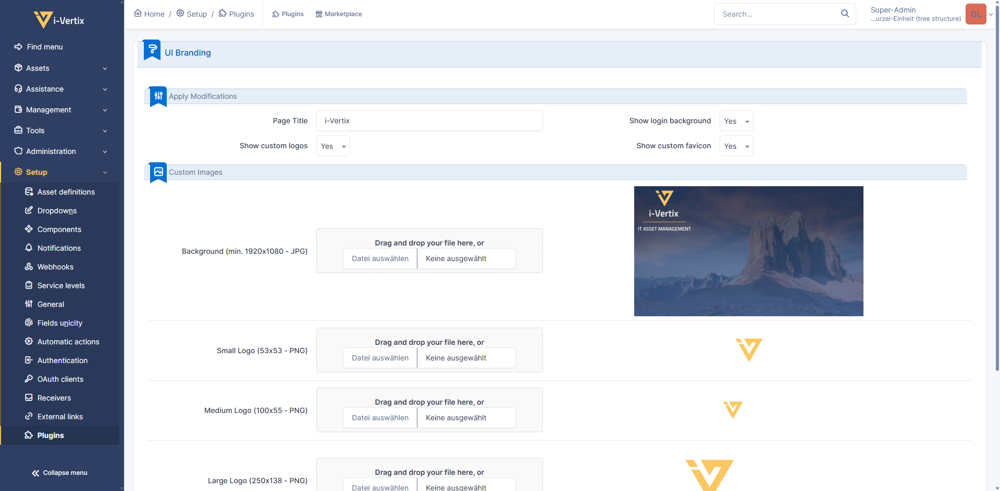

[](https://i-vertix.com)

# UI Branding GLPI Plugin

This plugin is used to customize brand-related images of your GLPI instance.

## 📋 Functionalities

- Customization of overall used brand logos (three different logo sizes)
- Customization of the page title (shown in tab)
- Add a background image to the login page

## 📌 Information

This plugin got restructured completely to match GLPI 11 and (hopefully) its successors.
The plugin initially emerged from
[https://github.com/stdonato/glpi-modifications](https://github.com/stdonato/glpi-modifications)
as the original author did continue to support the original plugin.
Since the plugin was forked from the original one, all of its code was rewritten and aligned to new GLPI guidelines.

This plugin and its maintainers are not connected to the GLPI project.

## 📤 Migration from GLPI 10.x

Since the plugin is very lightweight and does not really do much (no database tables ecc.), we decided to **not have** a
"real" migration (current custom images will be lost).
If you want to reuse your customized images, please create a backup before installing
the new version into the GLPI plugins folder. The images are located in `<glpi root>/plugins/mod/resources`.
Additionally, please **remove the current backup directory** located in `<glpi root>/files/_plugins/mod/backups`.

## 🔧 Installation

> [!IMPORTANT]
> For installation procedures of older versions, please have a look at the readme in the version-corresponding branch!

1. Download the latest version
   from [https://github.com/i-Vertix/glpi-modifications/releases](https://github.com/i-Vertix/glpi-modifications/releases).
2. Extract the archive into the GLPI `plugins` folder (when updating, make sure to delete the current `mod` folder
   first)
3. The new folder inside of `plugins` must be named `mod`
4. All files inside the folder must have at least `read` permissions for your webserver user
5. The following additional permissions for your webserver user are required for the plugin to work properly:

    - `read/write` permissions on the `<glpi root>/files/_plugins` directory as the plugin will create the directory
      `mod` inside of it
    - `read/write` permissions on the `<glpi root>/public/pics` directory
    - `read/write` permissions on the `<glpi root>/public/pics/favicon.ico` file
    - `read/write` permissions on the `<glpi root>/public/pics/logos` directory
    - `read/write` permissions on **all files** inside of `<glpi root>/public/pics/logos` directory
    - In case you are using SELinux, you must verify that your apache/webserver user has the permission to `chmod` his own files (necessary to uninstall the plugin correctly)

   Here are some prepared commands for you to execute from the **glpi root directory**, presuming your webserver user is
   already the owner of all relevant files and directories:

   ```shell
   sudo chmod 644 ./public/pics/logos/*
   sudo chmod 644 ./public/pics/favicon.ico
   ```
   With this command you can disable SELinux for apache/webserver related stuff (to verify):

   ```shell
   setsebool -P httpd_unified 1
   ```
   
7. In case you migrated from GLPI 10 and created a backup of your customized images you can now move the image backups
   to `./plugins/mod/resources/images`
8. Log into GLPI with a super-admin account and install the plugin
9. After the installation is completed, activate the plugin

## 👨‍🔧 Use the plugin

Access the UI Branding page from the *Configure* button on the list item of your plugin page.



This is the only page this plugin brings into your GLPI instance.

In case you want to revert to the original images, deactivate all entries under *Apply Modifications*.
The rest is more or less self-explanatory.

If you uninstall the plugin or disable it, all backups are restored automatically.

## 🗿 Uninstall

Please uninstall the plugin from the GLPI plugins page before removing any plugin files!
Otherwise, all backups of original files are lost.
We do not take any credit for any loss of original files!

## 📢 Notice

The plugin is and will not be published on the GLPI marketplace.
